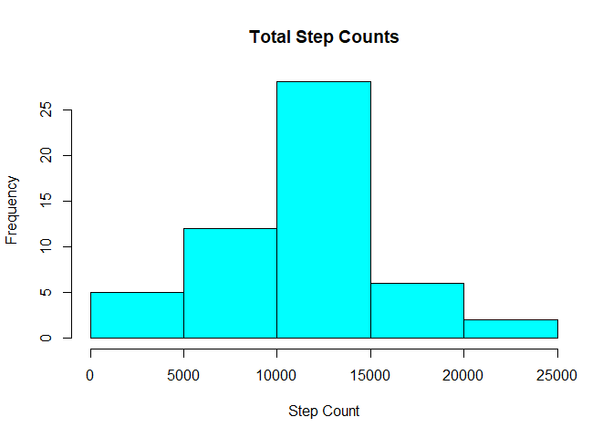
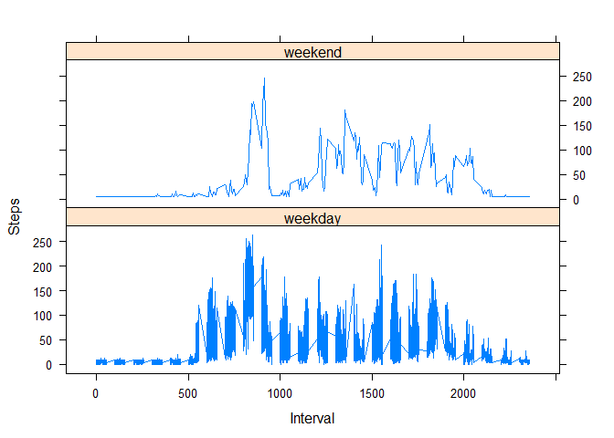

# Reproducible Research: Peer Assessment 1
## Loading and preprocessing the data

```r
sourceRecords <- "activity.zip"

if(!file.exists("activity.csv")) {
        unzip(sourceRecords)
}

##create data frame
stepData <- read.csv("activity.csv")

##transform date column from factor to POSIX date format
stepData$date <- as.POSIXct(stepData$date, format="%Y-%m-%d")
```
## What is mean total number of steps taken per day?

```r
##determine steps per day ignoring any NA for now
daily_step_sum <- aggregate(stepData$steps, by = list(stepData$date), FUN=sum)
names(daily_step_sum) <- c("Date", "Total_Steps")

##exploratry plot histogram of total step counts
hist(daily_step_sum$`Total_Steps`, main = paste("Total Step Counts"), col="cyan", xlab = "Step Count", ylab = "Frequency")
```

<!-- -->

```r
##determine mean and median value of steps
stepMean <- mean(daily_step_sum$Total_Steps, na.rm = TRUE)
stepMedian <- median(daily_step_sum$Total_Steps, na.rm = TRUE)
```

## What is the average daily activity pattern?

```r
## explore the five minute intervals to see what is happening
step_interval <- aggregate(stepData$steps, by = list(stepData$interval), FUN=mean, na.rm = TRUE)
names(step_interval) <-c("interval", "mean")

##time series over 5 minute intervals
plot(step_interval$interval, step_interval$mean, type = "l", col = "darkmagenta", xlab = "Interval (5min)", ylab = "AVG steps", main = "Avg Steps per 5 Minute Intervals")
```

<!-- -->

```r
##determine which interval, on average, the maximum number of steps resides
max_pos <- which(step_interval$mean == max(step_interval$mean))
max_interval <- step_interval[max_pos, 1]
```


## Imputing missing values

```r
##time for data cleanup - imput the missing values
na_count <- sum(is.na(stepData$steps))

##replace missing values with the average for that interval

##find missing data
missing_steps <- which(is.na(stepData$steps))

##create new data
substitute_step_data <- rep(mean(stepData$steps, na.rm = TRUE), times = length(missing_steps))

##replace missing with new data
stepData[missing_steps, "steps"] <- substitute_step_data
##new xploratory plot of histogram of total steps
clean_daily_step_sum <- aggregate(stepData$steps, by = list(stepData$date), FUN=sum)
names(clean_daily_step_sum) <- c("Date", "Total_Steps")
hist(clean_daily_step_sum$`Total_Steps`, main = paste("Total Step Counts"), col="cyan", xlab = "Step Count", ylab = "Frequency")
```

<!-- -->

```r
##idnetify new mean and median
cleanStepMean <- mean(clean_daily_step_sum$Total_Steps)
cleanStepMedian <- median(clean_daily_step_sum$Total_Steps)
```


## Are there differences in activity patterns between weekdays and weekends?

```r
## add a new factor to determine if weekday or not from the tidy data
## step 1 add factor for day of the week
stepData <- data.frame(date=stepData$date, weekday=tolower(weekdays(stepData$date)),steps = stepData$steps, interval = stepData$interval)
## step 2 detemine if weekday or weekend
stepData <- cbind(stepData, weekend_check=ifelse(stepData$weekday == "saturday" | stepData$weekday == "sunday,", "weekend", "weekday"))

##create panel plot
library(lattice)

plot_data <-aggregate(stepData$steps, by = list(stepData$weekend_check, stepData$weekday, stepData$interval), mean)
names(plot_data) <- c("weekend_check", "weekday", "interval", "mean")
xyplot(mean ~ interval | weekend_check, plot_data, type = "l", lwd = "1", xlab = "Interval", ylab = "Steps", layout= c(1,2))
```

<!-- -->

